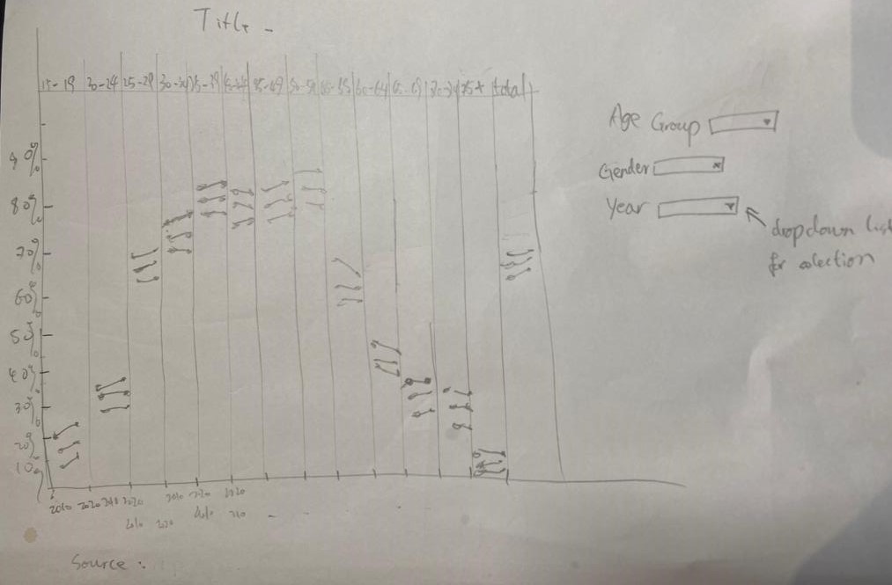

```{r setup, include=FALSE}
knitr::opts_chunk$set(echo = FALSE)
```

```{r}
packages = c('tidyverse', 'readxl', 'knitr')

for(p in packages){
  if(!require(p, character.only = T)){
    install.packages(p)
  }
  library(p, character.only = T)
}
```

```{r}
critiques <- read_xlsx("Data/Critiques.xlsx",
                      sheet = "Sheet1")
```
### 1. Critiques:  
Create table for critiques:

```{r}
knitr::kable(critiques,align="lll")
```

### 2. Alternative Design

The proposed design is as follows.



### 3.Proposed Visualisation

Please view the interactive visualisation on [here]()

### 4.Step-by-step Guide

Before getting started:
Once open the excel file, we can find two tables. Upon observation, the initial chart is using table 2 with five years interval, instead of ten, which provide a more detailed overview regarding LFPR. 

