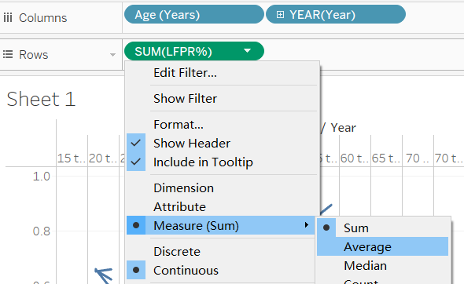
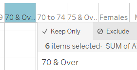
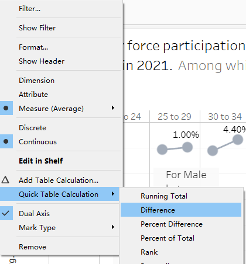

```{r setup, include=FALSE}
knitr::opts_chunk$set(echo = FALSE)
```

```{r}
packages = c('tidyverse', 'readxl', 'knitr')

for(p in packages){
  if(!require(p, character.only = T)){
    install.packages(p)
  }
  library(p, character.only = T)
}
```

```{r}
critiques <- read_xlsx("Data/Critiques.xlsx",
                      sheet = "Sheet1")
```
### 1. Critiques:  
Create table for critiques:

```{r}
knitr::kable(critiques,align="lll")
```

### 2. Alternative Design

The proposed design is as follows.


### 3.Proposed Visualisation

Please view the interactive visualization on [here]()


### 4.Step-by-step Guide

#### 4.1 Prepare the dataset

Before getting started:
Once open the excel file, we can find two tables. Upon observation, the initial chart is using table 2 with five years interval, instead of ten, which provide a more detailed overview regarding LFPR. 


1. For each data set(Female, Male and Total), select only the relevant cells. Create three new sheets and insert the cells respectively. Name the sheets"Female", "Male" and "Total" respectively.
2. Import data from the excel file, use Tableau to clean the data. 
   * Select Male table. We'll use tableau to create a pivot table.  Put Measure Values(`#`) in columns, Age(Years)/ Sex in row.
      + Hide numbers from 1991-2009, since we won't use them for the analyse.
   
     + Remove CNT, since we won't need it for the analyse.  
   
   
     + View the data in Tableau.
   
   
     + Put the Measure Names under detail, so the toolkit will show year as an indicator. Export and save the data under the File `Data`. The Data file locates in the same home directory as dv1.rmd
   
   
   * Repeat the steps for the Female and Total as well.
   * Merge the three files into one workbook using MS Excel. Add a column "Category" to differentiate the data source.
  
#### 4.2 Plot the chart using Tableau
**No.**|**Move**|**Action**|
-|-|--- |
1|Import the cleaned dataset into Tableau.| |
2|Create the a union by clicking on 'New Union' tab and drag the three tables in into the box.||
3|Adjust the name of the header, change the datatype accordingly. Edit the name of 'measure name' into LFPR||
4|Convert the LFPR into percentage(divided by 100) by adding a calculated field||
5|Add Age (Years) and YEAR to the Column tab and LFPR% to the Rows tab. Change the default Measure (Sum) into Measure (Average).Make it the average for the 3 categories of genders (T, F, M)||
6|Add Category column to detail,Assign category(T,M,F) with different colors.||
7|Select the drop-down menu in the filter tab and select ‘Show Filter’ to display the filter sidebar.||
8|Add year filters, select drop-down list.|| 
9|Check out the year from 2011 to 2020. Keep only the 2010 and 2021 for display. ||
9.1|Repeat the step for Age(Years), and Category as well.| |
10|Exclude the 70& Over, keep the intervals evenly distributed.||
11|the base graph looks like this||
|Since we focus on the changes happened in the 12 years, so it's important to have the difference calculated.The next would be to create a dual axis with markers showing increase/decrease in percentage. This can be realized by duplicating the axis.|
12|Add another AVG (LFPR%) to create a dual axis.Click on the drop-down list to select dual axis, the second axis would be integrated.||
13|Deselect show header to hide header.||
14|Change panel from Line to Circle to show marks in the main graph.||
15|Adjust the size of the circle by click on the Size button.||
16|Duplicate AVG (LFPR %) in the Rows tab, click on the down arrow, and create a Quick Table Calculation for Difference.(This row should be deleted later)||
17|Click on the drop-down list, select computing using and ensure that the Pane (across) option is selected.||
18|Double click the variable in the Row tab and copy the formula.||
19|Right Click the blank space in the left hand side and select create a calculated field and change the name to Difference. Repeat the process to create two other variables for the Increase and Decrease respectively.||
20|Here we want to use *Label* to differentiate the Decrease and Increase fields, use red color to highlight decrease and green to mark increase. Start from increase, in order to filter out the negative value for increase, we can edit the Increase Field using *IIF([Difference]>0,[Difference],NULL)*. Repeat the step for decrease. ||
20|Drag both the Increase and Decrease fields into the label tab. Double click the Label tab, edit the parameters accordingly, set increase to green, and decrease to red.||
21|Right click on the main graph area and select annotate. Type in insights and observations in the text area. Arrange, resize, or format the resulting text box if required.||
22|Edit Tooltip to delete the "% Difference in Avg. LFPR% from the Previous along Table (Across):"||
23|Change the the format of LFPR% to xx% by select from dropdown list.||
24|Ensure the Marks to Label checks most recent.||
25|Change the data format from Decrease and Increase fields to percentile. Save to 2 decimals.|| 

#### 4.3 The finalized Tableau chart.
Here is the link to the [Tableau chart](https://public.tableau.com/app/profile/yiou3293/viz/DataViz1_Yiou/DataViz1?publish=yes).


### 5.Observations

#### 5.1

In general, compare to 2010, people are more engaged in the labor market in 2021. This trend can be observed across all age-groups above 15 years old.

#### 5.2

When breaking down the number into female and male group, we can observe a interesting trend. Although LFPR in Male has higher absolute number, Female LFPR has more advantage in growing. During the 12 years the Female LFPR increased by 7.7%, reaching 64% in 2021, whereas Male LFPR only made a minor 0.7% growth across all ages.This change suggest more women in Singapore are joining the labor force and enjoy a more [financially independent lifestyle.](https://stats.mom.gov.sg/Pages/a-gender-inclusive-workforce.aspx#:~:text=The%20rise%20in%20LFPR%20among,2018%20to%2061.2%25%20in%202020)

#### 5.3
Another interesting finding is observed from age perspective. For people over 60 years old, the growth rate of LFPR in 10% on average by estimation, especially for the age group 65 to 70, where the 1/5 of the increase is achieved during the past 12 years. With the aging population and longer life expetancy, people could enjoy a healthy and active life even after 65. Another reason behind the growth of LFPR in senior group is the declining birth-rates and slower population growth, which also caused [shifts in the natures of labour force and supply.](https://stats.mom.gov.sg/Pages/Growing_Alongside_Our_Ageing_Workforce.aspx)

#### 5.4
It's worth mention that during COVID-19 pandemic, the labor market in Singapore is relatively resilient. Though some age-group suffer from a drastic drop between 2019-2020 period, yet it still made to recover in 2021. For instance in age group 20-24, the LFPR took a deep dive from 61% in 2019 to 56% in 2020, making a decrease of 5%. However, it quickly recovers and grew back to 62% in 2021.


