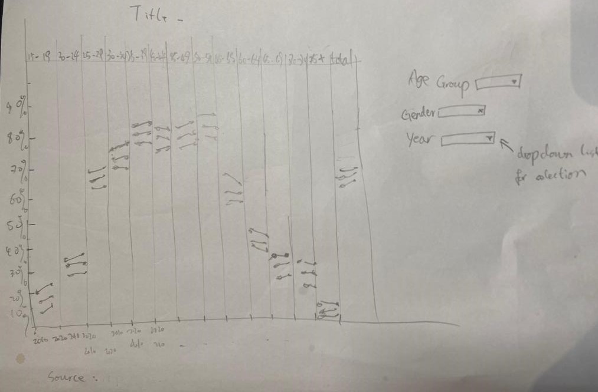
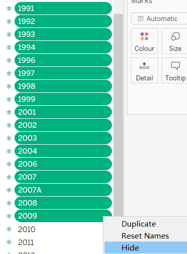
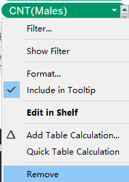
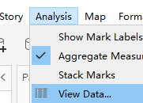
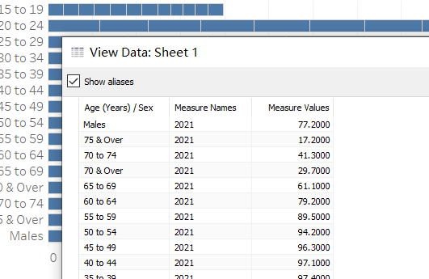
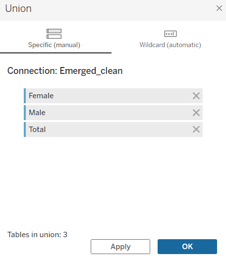
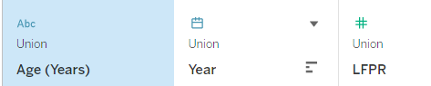
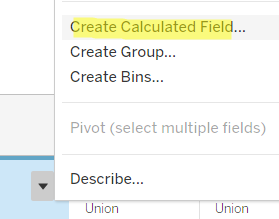
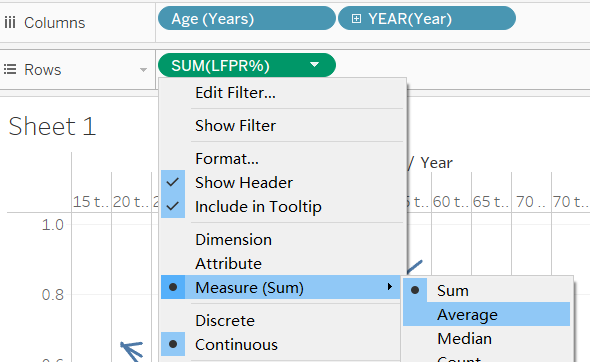
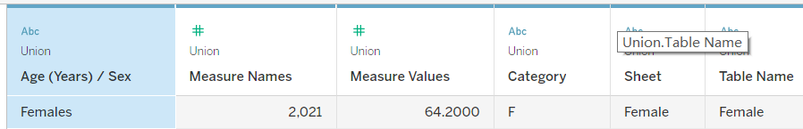

```{r setup, include=FALSE}
knitr::opts_chunk$set(echo = FALSE)
```

```{r}
packages = c('tidyverse', 'readxl', 'knitr')

for(p in packages){
  if(!require(p, character.only = T)){
    install.packages(p)
  }
  library(p, character.only = T)
}
```

```{r}
critiques <- read_xlsx("Data/Critiques.xlsx",
                      sheet = "Sheet1")
```
### 1. Critiques:  
Create table for critiques:

```{r}
knitr::kable(critiques,align="lll")
```

### 2. Alternative Design

The proposed design is as follows.



### 3.Proposed Visualisation

Please view the interactive visualization on [here]()


### 4.Step-by-step Guide

#### 4.1 Prepare the dataset

Before getting started:
Once open the excel file, we can find two tables. Upon observation, the initial chart is using table 2 with five years interval, instead of ten, which provide a more detailed overview regarding LFPR. 


1. For each data set(Female, Male and Total), select only the relevant cells. Create three new sheets and insert the cells respectively. Name the sheets"Female", "Male" and "Total" respectively.
2. Import data from the excel file, use Tableau to clean the data. 
   * Select Male table. We'll use tableau to create a pivot table.  Put Measure Values(`#`) in columns, Age(Years)/ Sex in row.
      + Hide numbers from 1991-2009, since we won't use them for the analyse.
   
     + Remove CNT, since we won't need it for the analyse.  
   
   
     + View the data in Tableau.
   
   
     + Put the Measure Names under detail, so the toolkit will show year as an indicator. Export and save the data under the File `Data`. The Data file locates in the same home directory as dv1.rmd
   
   
   * Repeat the steps for the Female and Total as well.
   * Merge the three files into one workbook using MS Excel. Add a column "Category" to differentiate the data source.
  

**No.**|**Move**|**Action**|
--- |--- |--- |
1|Import the cleaned dataset into Tableau.| |
2|Create the a union by clicking on 'New Union' tab and drag the three tables in into the box.||
3|Adjust the name of the header, change the datatype accordingly. Edit the name of 'measure name' into LFPR||
4|Convert the LFPR into percentage(divided by 100) by adding a calculated field||
5|Add Age (Years) and YEAR to the Column tab and LFPR% to the Rows tab.||
```6|xxx||
7|xxx||
8|xxx||
9|xxx||```